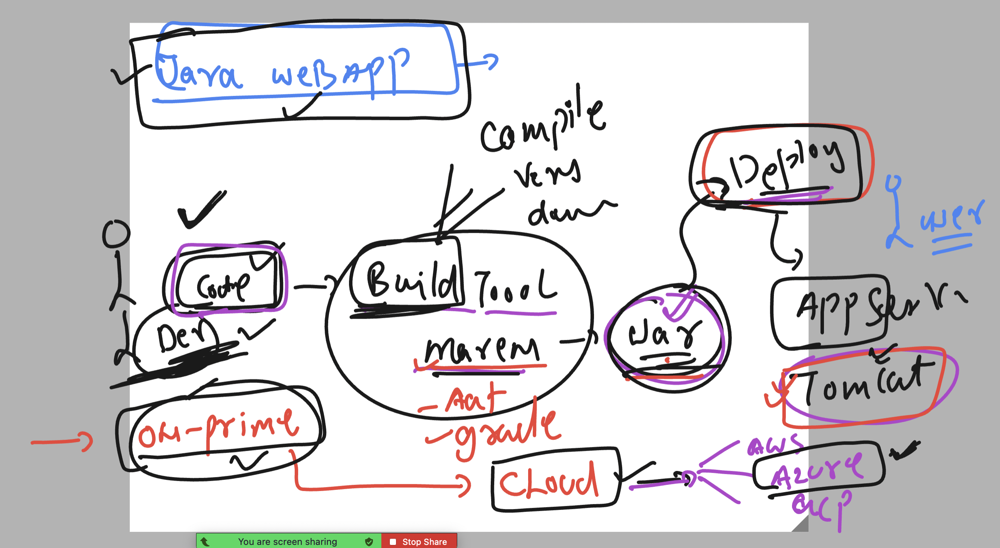
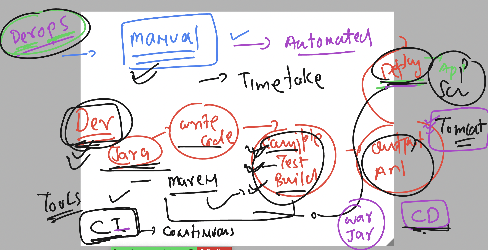
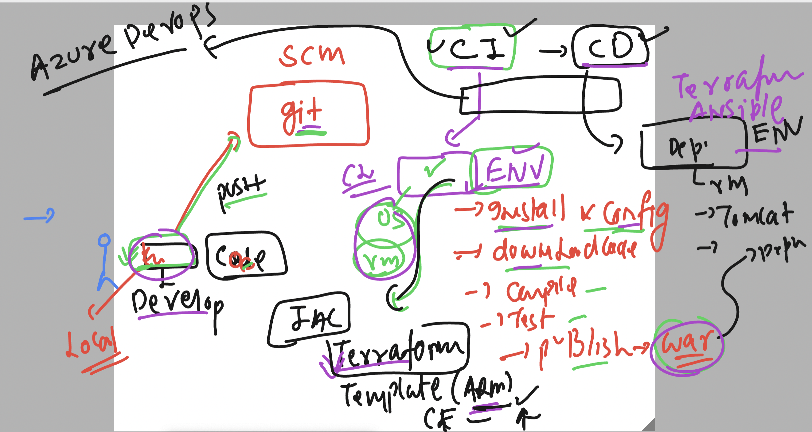
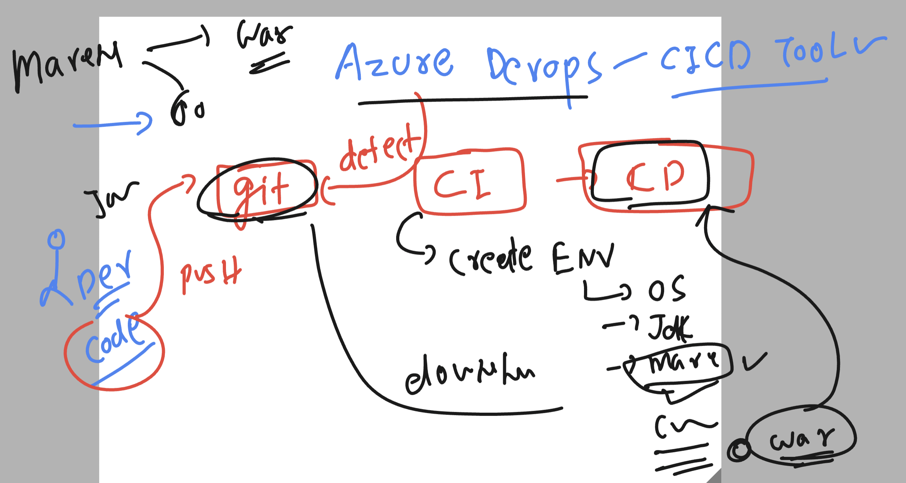
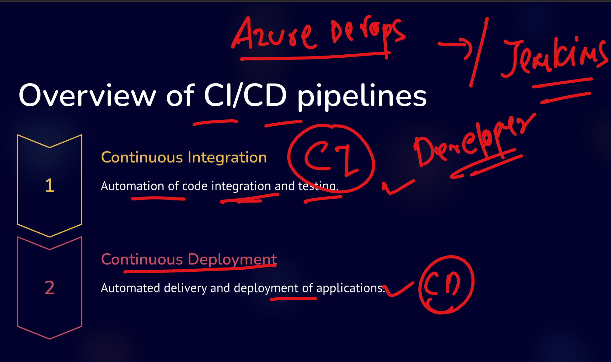
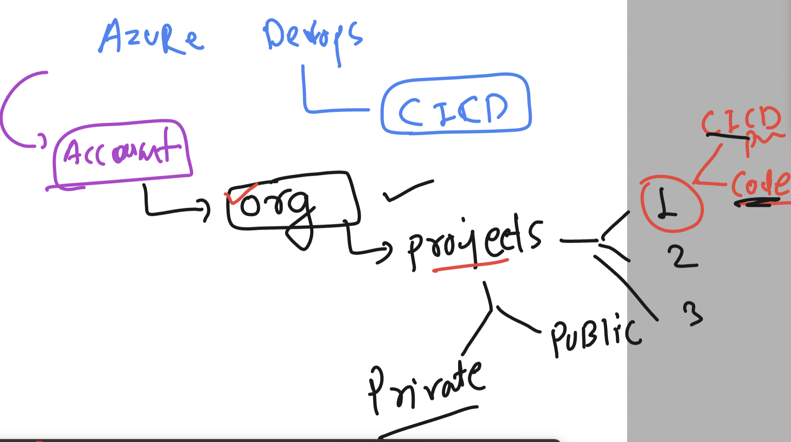
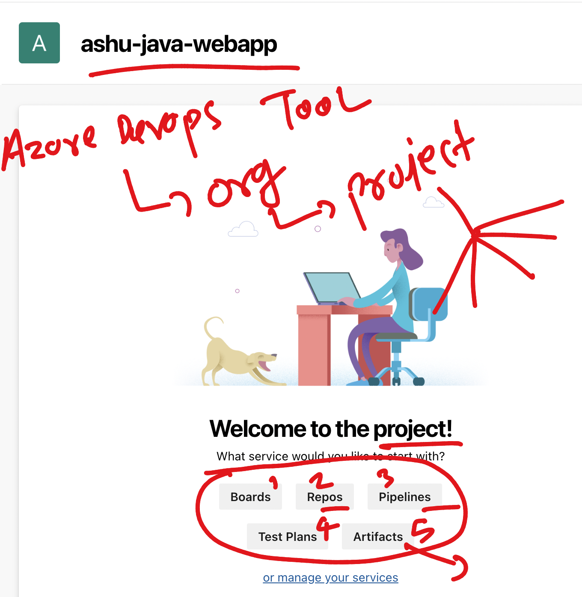
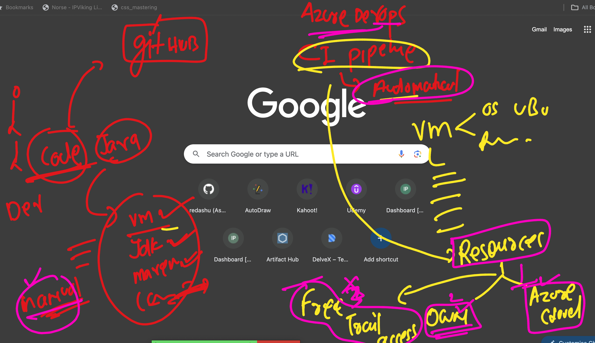
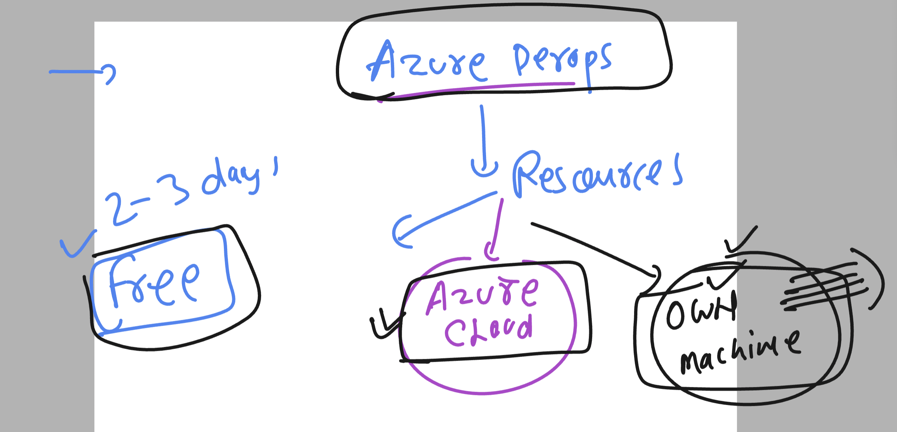

### In general application Deployment and desing process 



### Introduction to Devops process automation using CICD --

### CI is for developers 
### CD is for Deployment engineers



### more about az devops as CICD tool 



### testing connection from local to remote dev machine using ssh 

```
PS C:\Users\humanfirmware> ssh  ashu@34.198.93.223
The authenticity of host '34.198.93.223 (34.198.93.223)' can't be established.
ED25519 key fingerprint is SHA256:V1+IA3sRNqc/uPx5nn8pCgwnxXcNUVrOa40EXx55kPk.
This key is not known by any other names
Are you sure you want to continue connecting (yes/no/[fingerprint])? yes
Warning: Permanently added '34.198.93.223' (ED25519) to the list of known hosts.
ashu@34.198.93.223's password:
   ,     #_
   ~\_  ####_        Amazon Linux 2
  ~~  \_#####\
  ~~     \###|       AL2 End of Life is 2025-06-30.
  ~~       \#/ ___
   ~~       V~' '->
    ~~~         /    A newer version of Amazon Linux is available!
      ~~._.   _/
         _/ _/       Amazon Linux 2023, GA and supported until 2028-03-15.
       _/m/'           https://aws.amazon.com/linux/amazon-linux-2023/

[ashu@ip-172-31-19-54 ~]$ whoami
ashu
[ashu@ip-172-31-19-54 ~]$


===>>
[ashu@ip-172-31-19-54 ~]$ java --version
openjdk 11.0.22 2024-01-16 LTS
OpenJDK Runtime Environment Corretto-11.0.22.7.1 (build 11.0.22+7-LTS)
OpenJDK 64-Bit Server VM Corretto-11.0.22.7.1 (build 11.0.22+7-LTS, mixed mode)
[ashu@ip-172-31-19-54 ~]$
```

### after uploading code lets use azure devops to ci and cd 


### azure devops for CICD process



### azure devops ORG-projects



### components of project



### azure devops resources options 




### giving own machine to azure devops to run and test your code 



### understanding azure devops resources distribution 


### Installing azure devops agent in custom laptop/pc/vm/cloud machine 

### installing agent 

```
ubuntu@ip-172-31-53-225:~$ mkdir  az-devops-agent 
ubuntu@ip-172-31-53-225:~$ cd  az-devops-agent/
ubuntu@ip-172-31-53-225:~/az-devops-agent$ wget  https://vstsagentpackage.azureedge.net/agent/3.234.0/vsts-agent-linux-x64-3.234.0.tar.gz
--2024-02-26 07:17:13--  https://vstsagentpackage.azureedge.net/agent/3.234.0/vsts-agent-linux-x64-3.234.0.tar.gz
Resolving vstsagentpackage.azureedge.net (vstsagentpackage.azureedge.net)... 72.21.81.200, 2606:2800:11f:17a5:191a:18d5:537:22f9
Connecting to vstsagentpackage.azureedge.net (vstsagentpackage.azureedge.net)|72.21.81.200|:443... connected.
HTTP request sent, awaiting response... 200 OK
Length: 161448866 (154M) [application/octet-stream]
Saving to: ‘vsts-agent-linux-x64-3.234.0.tar.gz’

vsts-agent-linux-x64-3.234.0.tar 100%[=========================================================>] 153.97M   126MB/s    in 1.2s    

2024-02-26 07:17:14 (126 MB/s) - ‘vsts-agent-linux-x64-3.234.0.tar.gz’ saved [161448866/161448866]

ubuntu@ip-172-31-53-225:~/az-devops-agent$ ls
vsts-agent-linux-x64-3.234.0.tar.gz
ubuntu@ip-172-31-53-225:~/az-devops-agent$ tar xvzf vsts-agent-linux-x64-3.234.0.tar.gz 
./
./config.sh


ubuntu@ip-172-31-53-225:~/az-devops-agent$ ./config.sh 

  ___                      ______ _            _ _
 / _ \                     | ___ (_)          | (_)
/ /_\ \_____   _ _ __ ___  | |_/ /_ _ __   ___| |_ _ __   ___  ___
|  _  |_  / | | | '__/ _ \ |  __/| | '_ \ / _ \ | | '_ \ / _ \/ __|
| | | |/ /| |_| | | |  __/ | |   | | |_) |  __/ | | | | |  __/\__ \
\_| |_/___|\__,_|_|  \___| \_|   |_| .__/ \___|_|_|_| |_|\___||___/
                                   | |
        agent v3.234.0             |_|          (commit 21ca259)


>> End User License Agreements:

Building sources from a TFVC repository requires accepting the Team Explorer Everywhere End User License Agreement. This step is not required for building sources from Git repositories.

A copy of the Team Explorer Everywhere license agreement can be found at:
  /home/ubuntu/az-devops-agent/license.html

Enter (Y/N) Accept the Team Explorer Everywhere license agreement now? (press enter for N) > y

>> Connect:

Enter server URL > https://dev.azure.com/walm-india-org
Enter authentication type (press enter for PAT) > 
Enter personal access token > ****************************************************
Connecting to server ...

>> Register Agent:

Enter agent pool (press enter for default) > 
Enter agent name (press enter for ip-172-31-53-225) > 
Scanning for tool capabilities.
Connecting to the server.
Successfully added the agent
Testing agent connection.
Enter work folder (press enter for _work) > 
2024-02-26 07:19:48Z: Settings Saved.
ubuntu@ip-172-31-53-225:~/az-devops-agent$ ls
_diag  bin  config.sh  env.sh  externals  license.html  run-docker.sh  run.sh  svc.sh  vsts-agent-linux-x64-3.234.0.tar.gz
ubuntu@ip-172-31-53-225:~/az-devops-agent$ ./run.sh 
Scanning for tool capabilities.
Connecting to the server.
2024-02-26 07:20:19Z: Listening for Jobs


```
