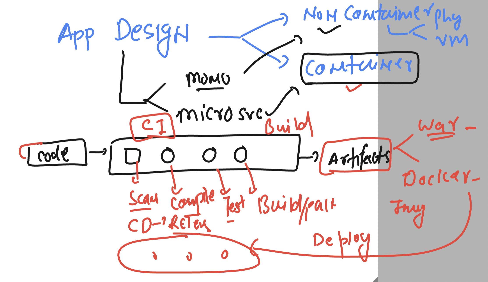
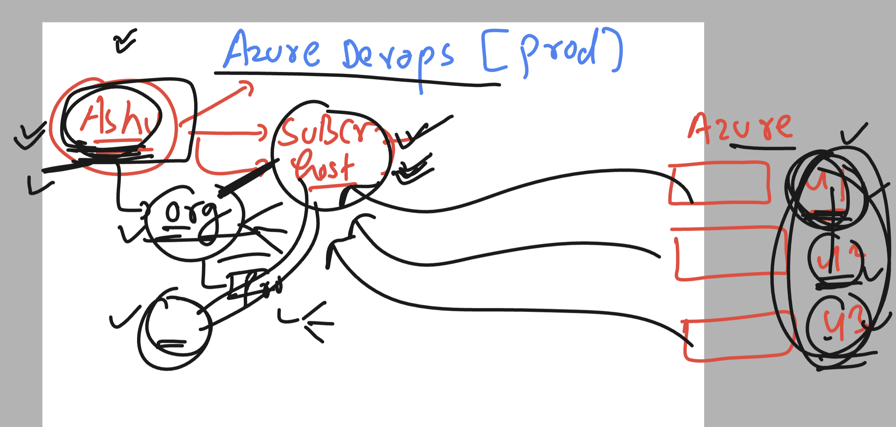
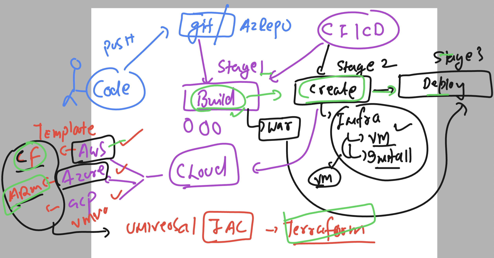
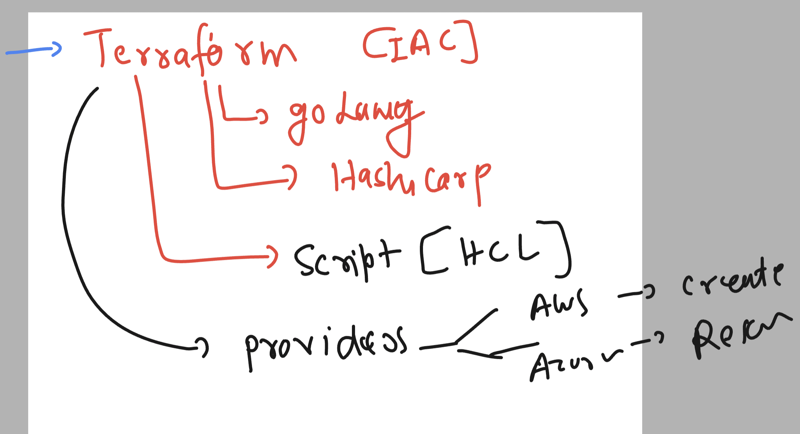

# Revision 



### azure devops users and groups



### IAC using terraform 



### more info about terraform 



### azure pipeline.yaml data

```
# Maven
# Build your Java project and run tests with Apache Maven.
# Add steps that analyze code, save build artifacts, deploy, and more:
# https://docs.microsoft.com/azure/devops/pipelines/languages/java changes

trigger:
- master

pool: Default # i want to use my own agent 
#  vmImage: ubuntu-latest

stages: 
- stage: ashuappbuild
  jobs:
  - job: runcommand
    steps:
    - script: echo 'hello world'
      displayName: 'testing stages and jobs'
      
  - job: runmavenbuild   
    steps:
    - task: Maven@3
      inputs:
        mavenPomFile: 'pom.xml'
        mavenOptions: '-Xmx3072m'
        javaHomeOption: 'JDKVersion'
        jdkVersionOption: '1.8'
        jdkArchitectureOption: 'x64'
        publishJUnitResults: true
        testResultsFiles: '**/surefire-reports/TEST-*.xml'
        goals: 'package'

```

### adding second stage there 

```
# Maven
# Build your Java project and run tests with Apache Maven.
# Add steps that analyze code, save build artifacts, deploy, and more:
# https://docs.microsoft.com/azure/devops/pipelines/languages/java changes

trigger:
- master

pool: Default # i want to use my own agent 
#  vmImage: ubuntu-latest

stages: 
- stage: ashuappbuild # build stage for create war file 
  jobs:
  - job: runcommand
    steps:
    - script: echo 'hello world'
      displayName: 'testing stages and jobs'
      
  - job: runmavenbuild   
    steps:
    - task: Maven@3
      inputs:
        mavenPomFile: 'pom.xml'
        mavenOptions: '-Xmx3072m'
        javaHomeOption: 'JDKVersion'
        jdkVersionOption: '1.8'
        jdkArchitectureOption: 'x64'
        publishJUnitResults: true
        testResultsFiles: '**/surefire-reports/TEST-*.xml'
        goals: 'package'

- stage: createinfraonAWSCloud  # trying to create VM in AWS cloud platform using terraform
  jobs:
  - job: testing_terraform_installation
    steps:
    - script: | 
        echo 'checking terraform version'
        terraform -v


```

