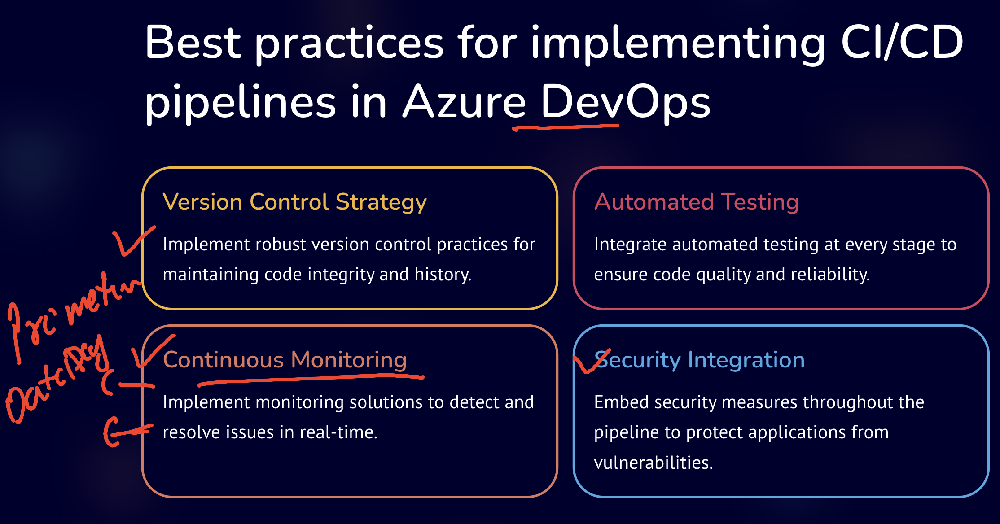
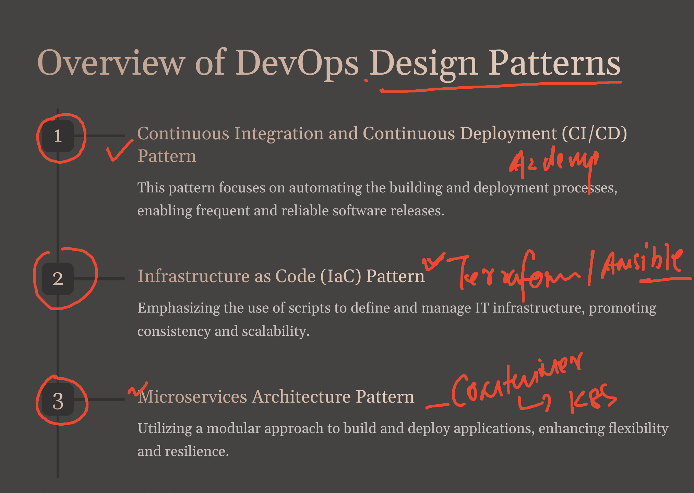
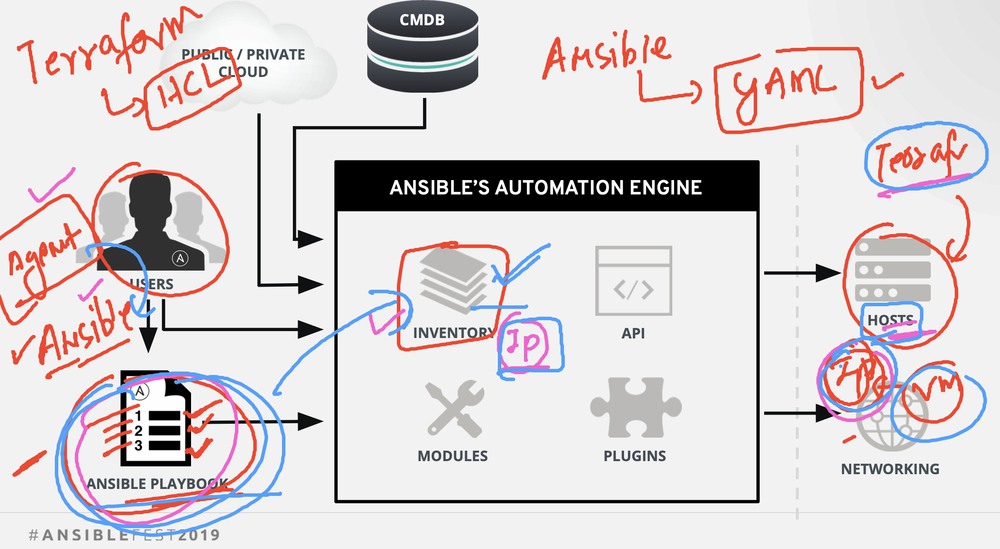

### COntiniuou monitoring also import 


### over app desing pattern need 



### updated azure pipeline yaml

```
# Maven
# Build your Java project and run tests with Apache Maven.
# Add steps that analyze code, save build artifacts, deploy, and more:
# https://docs.microsoft.com/azure/devops/pipelines/languages/java changes

trigger:
- master

pool: Default # i want to use my own agent 
#  vmImage: ubuntu-latest

stages: 
- stage: ashuappbuild # build stage for create war file 
  jobs:
  - job: runcommand
    steps:
    - script: echo 'hello world'
      displayName: 'testing stages and jobs'
      
  - job: runmavenbuild   
    steps:
    - task: Maven@3
      inputs:
        mavenPomFile: 'pom.xml'
        mavenOptions: '-Xmx3072m'
        javaHomeOption: 'JDKVersion'
        jdkVersionOption: '1.8'
        jdkArchitectureOption: 'x64'
        publishJUnitResults: true
        testResultsFiles: '**/surefire-reports/TEST-*.xml'
        goals: 'package'
    - script: | 
        echo "current maven build"
        ls 

- stage: createinfraonAWSCloud  # trying to create VM in AWS cloud platform using terraform
  jobs:
  - job: testing_terraform_installation
    steps:
    - script: | 
        sudo snap install terraform --classic # incase we want to install from pipeline 
        echo 'checking terraform version'
        ls 
        mkdir -p /tmp/ashutf
        cp -rf terraform_code/*.tf /tmp/ashutf/
        terraform -v
        echo 'Now lets run terraform code'
        cd /tmp/ashutf
        terraform init # it will download module of terraform 
        terraform plan  # will let you know what is going to happen 
        sleep 2
        terraform apply -target=aws_key_pair.ashu_genkey --auto-approve  # create resources in aws cloud 
        terraform apply --auto-approve


```

### now ansible will install and configure java / tomcat in vm created by terraform using azdevops 



### ansible playbook for tomcat install and configure 

```
---
- name: Install and Start Apache Tomcat
  hosts: all  # all machine what ever inventory has 
  remote_user: ec2-user
  become: yes

  vars:
    tomcat_version: "9.0.86"

  tasks:
    - name: Install Tomcat dependencies
      package:
        name:
          - unzip
          - wget

    - name: Download Apache Tomcat
      get_url:
        url: "https://dlcdn.apache.org/tomcat/tomcat-9/v9.0.86/bin/apache-tomcat-9.0.86.tar.gz"
        dest: "/tmp/apache-tomcat.tar.gz"

    - name: 
      yum:
       name: java-1.8*
       state: present
    - name: Extract Tomcat archive
      ansible.builtin.unarchive:
        src: "/tmp/apache-tomcat.tar.gz"
        dest: "/opt"
        remote_src: yes

      
    - name: Start Tomcat service
      command: "chmod 755 /opt/apache-tomcat-9.0.86/ -R"
    - name: Start Tomcat service
      command: "nohup /opt/apache-tomcat-9.0.86/bin/startup.sh"
```


### updated terraform code

```
provider "aws" {
   region = "us-east-1" # NV 
}
# creating key pair to connect cloud machine
resource "tls_private_key" "ashu-key" {
  algorithm = "RSA"
  rsa_bits  = 4096
} 
# creating key pair using above alog 
resource "aws_key_pair" "ashu_genkey" {
  key_name   = "ashu_private_key"
  public_key = tls_private_key.ashu-key.public_key_openssh
  provisioner "local-exec" { # Create "myKey.pem" to your computer!!
    command = "echo '${tls_private_key.ashu-key.private_key_pem}' > ~/ashukey.pem"
  }
}

# now using resource to create Virutal machine 
resource "aws_instance" "ashuvm" {

    ami = "ami-07761f3ae34c4478d"
    instance_type = "t2.micro"

    key_name = "ashu_private_key"
    tags = {
      "Name" = "ashu-linux-vm"
    }
    # fetching ip address of vm  this file will be used by ansible as inventory 
     provisioner "local-exec" {
    command = "echo [ashu] >~/ashuvmip.txt && echo '${aws_instance.ashuvm.public_ip}' >> ~/ashuvmip.txt"
  }

}
```

### azure pipeline 

```
# Maven
# Build your Java project and run tests with Apache Maven.
# Add steps that analyze code, save build artifacts, deploy, and more:
# https://docs.microsoft.com/azure/devops/pipelines/languages/java changes

trigger:
- master

pool: Default # i want to use my own agent 
#  vmImage: ubuntu-latest

stages: 
- stage: ashuappbuild # build stage for create war file 
  jobs:
  - job: runcommand
    steps:
    - script: echo 'hello world'
      displayName: 'testing stages and jobs'
      
  - job: runmavenbuild   
    steps:
    - task: Maven@3
      inputs:
        mavenPomFile: 'pom.xml'
        mavenOptions: '-Xmx3072m'
        javaHomeOption: 'JDKVersion'
        jdkVersionOption: '1.8'
        jdkArchitectureOption: 'x64'
        publishJUnitResults: true
        testResultsFiles: '**/surefire-reports/TEST-*.xml'
        goals: 'package'
    - script: | 
        echo "current maven build"
        ls 

- stage: createinfraonAWSCloud  # trying to create VM in AWS cloud platform using terraform
  jobs:
  - job: testing_terraform_installation
    steps:
    - script: | 
        sudo snap install terraform --classic # incase we want to install from pipeline 
        echo 'checking terraform version'
        ls 
        mkdir -p /tmp/ashutf
        cp -rf terraform_code/*.tf /tmp/ashutf/
        terraform -v
        echo 'Now lets run terraform code'
        cd /tmp/ashutf
        terraform init # it will download module of terraform 
        terraform plan  # will let you know what is going to happen 
        sleep 2
        terraform apply -target=aws_key_pair.ashu_genkey --auto-approve  # create resources in aws cloud 
        terraform apply --auto-approve

- stage: ansibletotomcat
  jobs:
  - job: installtomcat
    steps:
    - script: | 
        echo 'checking ansible installation and version'
        ansible --version 
        echo 'running playbook using ansible '
        ansible-playbook -i ~/ashuvmip.txt --private-key=~/ashukey.pem  playbook/tomcat_install.yaml 


```

### adding docker approach using dockerfile 

```
FROM oraclelinux:8.4 as BUILDER
LABEL name=ashutoshh
RUN dnf install java-1.8.0-openjdk.x86_64  java-1.8.0-openjdk-devel.x86_64  maven  -y 
WORKDIR /ashu-java
COPY .  . 
# now running maven to create .war file 
RUN mvn install 
# copy war into tomcat docker image 
FROM tomcat 
COPY --from=BUILDER /ashu-java/target/*.war /usr/local/tomcat/webapps/
```

### pipeline for docker based build

```
# Docker
# Build a Docker image
# https://docs.microsoft.com/azure/devops/pipelines/languages/docker

trigger:
- master

resources:
- repo: self

variables:
  tag: '$(Build.BuildId)'

stages:
- stage: Build
  displayName: Build image
  jobs:
  - job: Build
    displayName: Build
    pool:
      vmImage: ubuntu-latest
    steps:
    - task: Docker@2
      displayName: Build an image
      inputs:
        command: build
        dockerfile: '$(Build.SourcesDirectory)/Dockerfile'
        tags: |
          $(tag)

```
